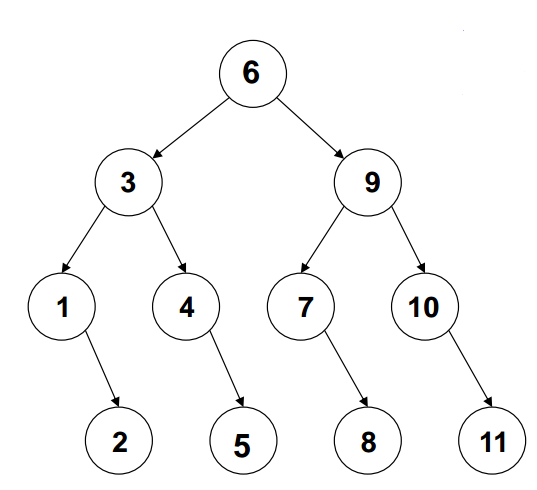
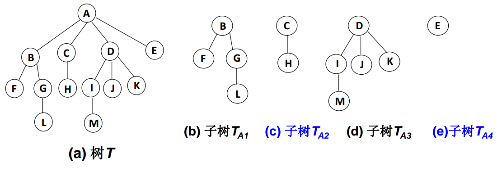
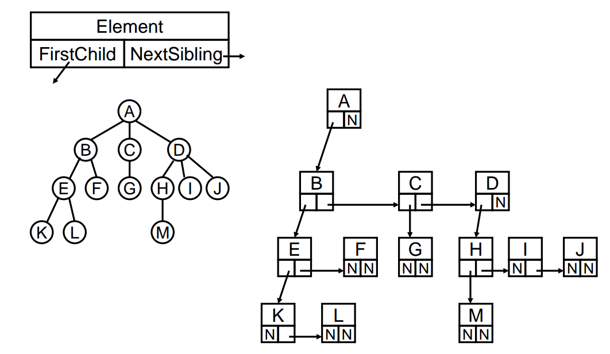
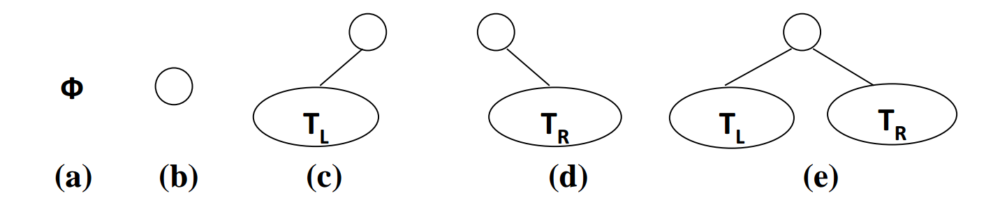
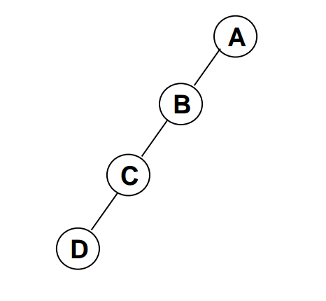
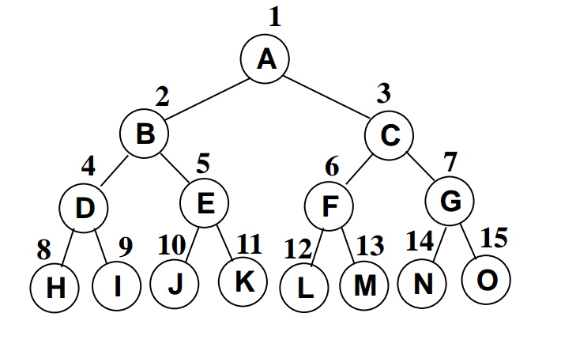
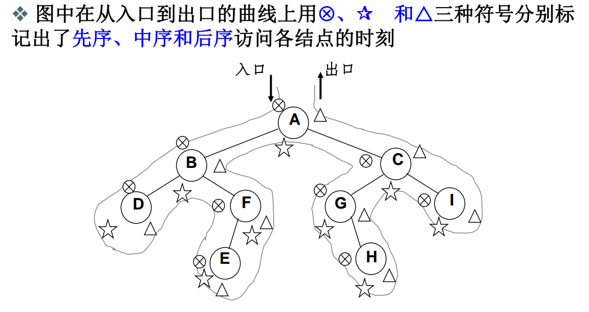

# 第三章 树

## 3.1 树与树的表示

### 3.1.1 什么是树

**客观世界中许多事物存在层次关系**

- 人类社会家谱
- 社会组织结构
- 图书信息管理

==分层次的组织在管理上具有更高的效率!==

**数据管理的基本操作之一：查找**

问：如何实现有效率的查找？

### 3.1.2 查找

**查找**：根据某个给定的关键字 K，从集合 R 中找出关键字与 K 相同的记录。

- 静态查找：集合中记录是固定的。
  - 没有插入和删除操作，只有查找。
- 动态查找：集合中记录是动态变化的。
  - 除查找，还可能发生插入和删除。

**静态查找方法**

- 方法1：顺序查找

  从头到尾一个一个比较数据，直到找到数据。

  ```java
  /**
  * 顺许查找
  * @param tbl 被查找的数据集
  * @param k 查找的关键字
  * @param <T> 数据集的数据类型
  * @return 返回 -1 表示查找失败。
  */
  public static<T> int sequentialSearch(T[]  tbl, T k){
      for(int i = 0; i < tbl.length; i++){
          if(tbl[i] == k){
          	return i;
          }
      }
  
      return -1;
  }
  ```

- 方法2：二分查找

  假设 n 个数据元素的关键字满足有序（比如：小到大），并且是连续存放（数组），那么可以进行二分查找。

  ```java
  /**
   * 二分查找。
   * @param tbl
   * @param k
   * @param <T>
   * @return 查找成功返回 对应位置, 失败返回 -1。
   */
  public static<T extends Comparable<T>> int binarySearch(T[] tbl, T k){
      int lo = 0;
      int hi = tbl.length-1;
  
      while (lo <= hi){
          int mid = (lo + hi)/2;
  
          if(tbl[mid].compareTo(k) == 0){
              return mid;
          }else if(tbl[mid].compareTo(k) == -1){
              lo = mid + 1;
          }else if(tbl[mid].compareTo(k) == 1){
              hi = mid -1;
          }
      }
  
      return -1;
  }
  ```

**二分查找判定树**



- 判定树上每个结点需要的查找次数刚好为该节点所在的层数。
- 查找成功时的查找次数不会超过判定树的深度。
- n 个节点的判定树的深度为 $$[logn]+1$$ 

### 3.1.3 树的定义

树 （Tree）：n (n >= 0) 个结点构成的有限集合。当 n == 0 时，称为空树。对于任何一个非空树 （ n > 0），它具备以下性质：

- 树中有一个称为 “根的节点” 的特殊节点，用 r 表示。
- 其余节点可以分为 m （m > 0 ）个互不相交的有限集 $$T_1, T_2, ... , T_m$$ 其中每个集合本身又是一棵树，这些树被称为原来的 “子树” （SubTree）。



**树与非树的区别**

- 子树是不相交的。
- 除了根结点外，每个结点有且仅有一个父结点。
- 一棵 N 个结点的树有 N-1 条边。

### 3.3.4 树的基本术语

- 节点的度（Degree）：结点的子树的个数。
- 树的度：树的所以结点中最大的度数。
- 叶结点（Leaf）：度为 0 的结点。
- 父结点（Parent）：有子树的结点是其子树根结点的父结点。
- 子结点（Child）：若 A 结点是 B 的父结点，则称 B 是 A 的子结点，子结点也成为孩子结点。
- 兄弟结点（Sibling）：具有同一父结点的各个结点彼此都是兄弟结点。
- 路径和路径长度：从结点 $$n_1 到 n_k $$ 的路径为一个结点序列 $$n_1, n_2, ... , n_k$$，（$$n_i 是 n_{i+1}$$的父结点）路径所包含边的个数为路径长度。
- 祖先结点（Ancestor）：沿树的根到某一节点路径上的所以结点都是这个结点的祖先结点。
- 子孙结点（Descendant）：某一结点的子树中的所有结点都是这个结点的子孙结点。
- 结点的层次（Level）：规定根结点在 1 层，其他任一结点的层数都是其父结点的层数加 1。
- 树的深度（Depth）：树中所以结点中的最大层次是这棵树的深度。

### 3.3.5 树的表示

- 孩子兄弟表示法

  

**注：**此表示方法旋转 45 度就是一颗二叉树了。

## 3.2 二叉树及存储结构

### 3.2.1 二叉树的定义

二叉树 T ：一个有穷的结点集合。这个集合可以为空，若不为空，则它是由根结点和称为其左子树 $$T_L$$ 和右子树 $$ T_R $$ 的两个不相交的二叉树组成。

- 二叉树具有五种基本形态

  

- 二叉树的==子树有左右顺序之分==

### 3.2.2 特殊二叉树

- 斜二叉树（Skewed Binary Tree）

  

- 完美二叉树（Perfect Binary Tree）或满二叉树（Full Binary Tree）

  

- 完全二叉树（Complete Binary Tree）

  有 n 个结点的二叉树，对树中结点按从上到下、从左到右进行编号，编号为 i (1 <= i <= n) 结点与满二叉树中编号为 i 结点在二叉树中位置相同。

### 3.2.3 二叉树几个重要性质

- 一个二叉树第 i 层的最大结点数为：$$2^{i-1}，i \ge 1$$ 。

- 深度为 k 的二叉树有最大结点总数为：$$2^k-1, K \ge 1$$。

- 对任何非空二叉树 T，若 $$n_0$$ 表示叶结点的个数，$$n_2$$ 是度为 2 的非叶结点个数，那么两者满足关系 $$n_0=n_2+1$$ 。

**最后一条性质的推导：**

假设一个二叉树有 $$n​$$ 个结点，其中 $$n_0​$$ 表示度为 0 的结点个数，$$n_1​$$ 表示度为 1 的结点个数，$$n_2​$$ 表示度为 2 的结点个数，则二叉树总的边树为：$$0 * n_0 + 1 * n_1 + 2 * n_2​$$ 。

又因为二叉树中除了根结点外，所以的结点向上都有一条边，所以：
$$
0 * n_0 + 1 * n_1 + 2 * n_2 = n_0 + n_1 + n_2 -1
$$
整理得：
$$
n_0 = n_2 + 1
$$

### 3.2.4 二叉树的抽象数据类型定义

类型名称：二叉树

数据对象集：一个有穷的结点集合，若不为空，则由根结点和其左右二叉树子树组成。

操作集：

```java
/**
 * 二叉树的抽象数据类型。
 * @author hkl
 * @date 2019/04/08
 */
public interface BinTree<T> {
    /**
     * 判断二叉树是否为空。
     * @return 为空返回 true，非空返回 false。
     */
    boolean isEmpty();
    
    /**
     * 前序遍历二叉树。
     */
    void preOrderTraversal();

    /**
     * 中序遍历二叉树。
     */
    void inOrderTraversal();

    /**
     * 后序遍历二叉树
     */
    void postOrderTraversal();

    /**
     * 层次遍历二叉树。
     */
    void levelOrderTraversal();

    /**
     * 创建二叉树。
     */
    void createBinTree();
}

```

### 3.2.5 二叉树的存储结构

**顺序存储结构**

已知二叉树有 n 个结点，其中一个结点的序号为 i，则:

- 如果为非根结点，则父结点的序号为 [i/2]。
- 结点的左孩子为 2i，若（2i > n，则没有左孩子）。
- 结点的右孩子为 2i+1，若（2i+1  > n），则没有右结点。     

顺序存储结构适合存储满二叉树或完全二叉树，对于稀疏二叉树会非常的浪费存储空间。    

**链表存储**

两个指针域和一个数据域，两个指针与一个指针执行左孩子，另一个指向右孩子。

## 3.3 二叉树的遍历

### 3.3.1 递归遍历二叉树

**先序遍历**

- 访问根结点
- 先序遍历左子树
- 先序遍历右子树

**中序遍历**

- 中序遍历左子树
- 访问根结点
- 中序遍历右子树

**后序遍历**

- 后序遍历左子树
- 后序遍历右子树
- 访问根结点

**遍历特点**

不管是先序遍历、中序遍历还是后序遍历，其访问结点的路线是一样的，只是访问结点的时机不同而已。



## 3.4 二叉搜索树

### 3.4.1 二叉搜索树的定义

二叉搜索树（BTS, Binary Search Tree），也称为二叉排序树或二叉查找树。

二叉搜索树：一颗二叉树，可以为空，如果不为空，满足以下性质：

1. 非空左子树的所以键值小于其根结点的键值。
2. 非空右子树的所有键值大于其根结点的键值。
3. 左、右子树都是二叉搜索树。

### 3.4.2 二叉搜索树常见的操作

```

```


