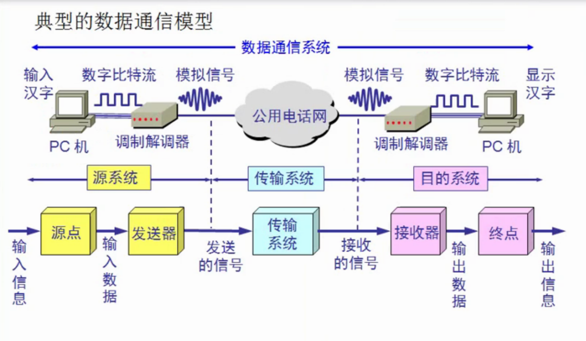
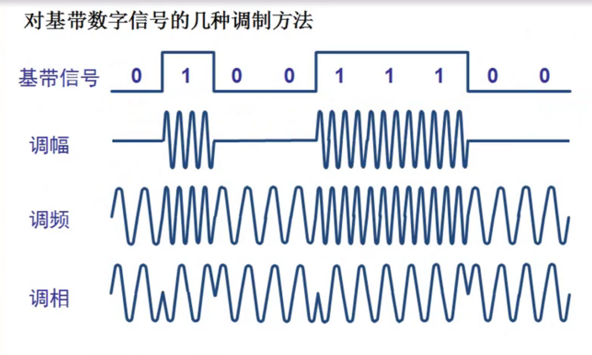
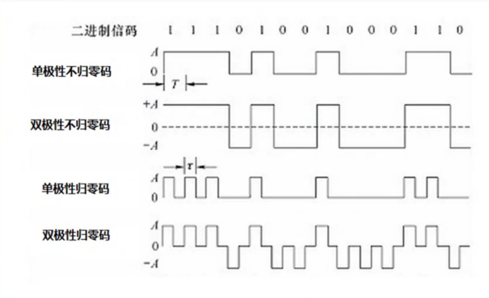
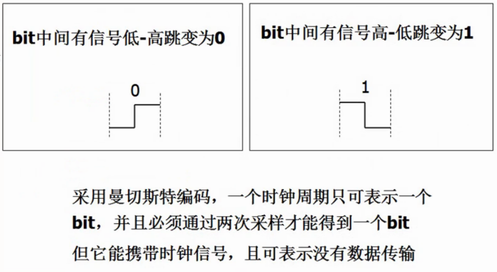
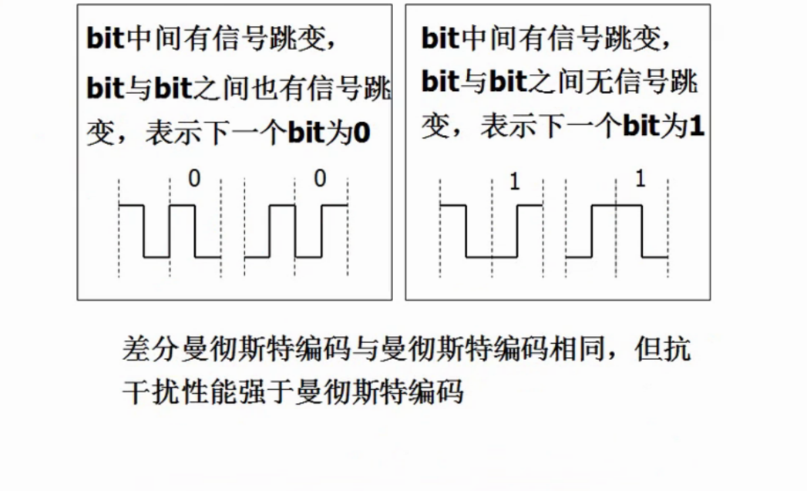
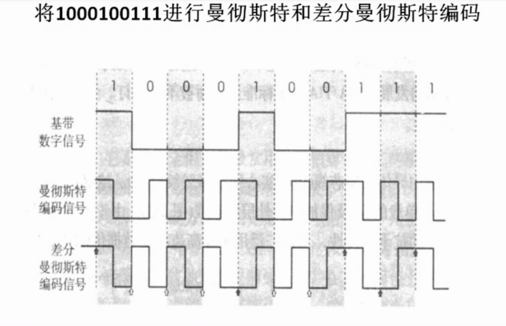

# 物理层

## 2.1 物理层的基本概念

物理层解决如何在**连接各种计算机的传输媒体**上传输**数据比特流**。

## 2.1.1 物理层相关特性

- 机械特性：例如接口形状、大小、引线数目。
- 电气特性：例如规定电压范围（-5V ～+5V）。
- 功能特性：例如规定-5V表示0，+5V表示1。
- 过程特性：也称规程特性，规定建立连接时各个相关部件的工作步骤。

## 2.2 数据通信的基础知识

### 2.2.1 数据通信模型

- 典型的数据通信模型

- 相关术语

  - 通信的目的是传送消息。
  - 数据（data）：运送消息的实体。
  - 信号（signal）：数据的电气或电磁的表现。
    - 模拟信号：代表消息的参数取值是连续的。
    - 数字信号：代表消息的参数取值是离散的。

  - 码原：在使用时间域的波形表示数字信号时，则代表不同离散数值的基本波形就成为码元。

### 2.2.2 信道相关概念

信道一般表示向一个方向传送信息的媒体，所以咱们平常说的通信线路往往包含一条发送信息的信道和一条接收信息的信道。

- 单向通信（单工通信）：只能有一个方向的通信而没有反方向的交互。
- 离比较近的时，计算机网络都采用基带传输方式，因为在近距离范围内基带信号的衰减不打，从而信号内容不会发生变化。

### 2.2.4 基本的调制方法

- 调幅（AM）：载波的振幅随基带数字信号而变化。
- 调频（FM）：载波的频率随基带数字信号而变化。
- 调相（PM）：载波的相位随基带数字信号而变化。

### 2.2.5 常用编码

- 单极性不归零码
  - 只使用一个电压值，用高电平表示1，没电压表示0。
- 双极性不归零码
  - 用正电平和负电平分别表示二进制数据的0和1，正负赋值相等。
- 单极性归零码
  - 以高电平和零电平分别表示二进制1和0，而且在发送码1时高电平在整个码元期间T只维持一段时间t，其余时间返回零电平。
- 双极性归零码
  - 正负零三个电平，信号本身携带同步信息。

以上所以编码在实际编码中的区别

- 曼切斯特编码

- 差分曼切斯特编码

曼切斯特编码和差分曼切斯特编码实际编码的情况

### 2.2.6 信道的极限容量

- 奈氏准则
- 香农公式

## 2.3 物理层下的传输媒体

## 2.4 信道复用技术

- 频分复用技术
- 时分复用技术
- 统计时分复用技术
- 波分复用技术（光的频分复用技术）

## 2.5 宽带接入技术

- xDSL
- 光纤同轴混合网HFC
- FTTx技术s